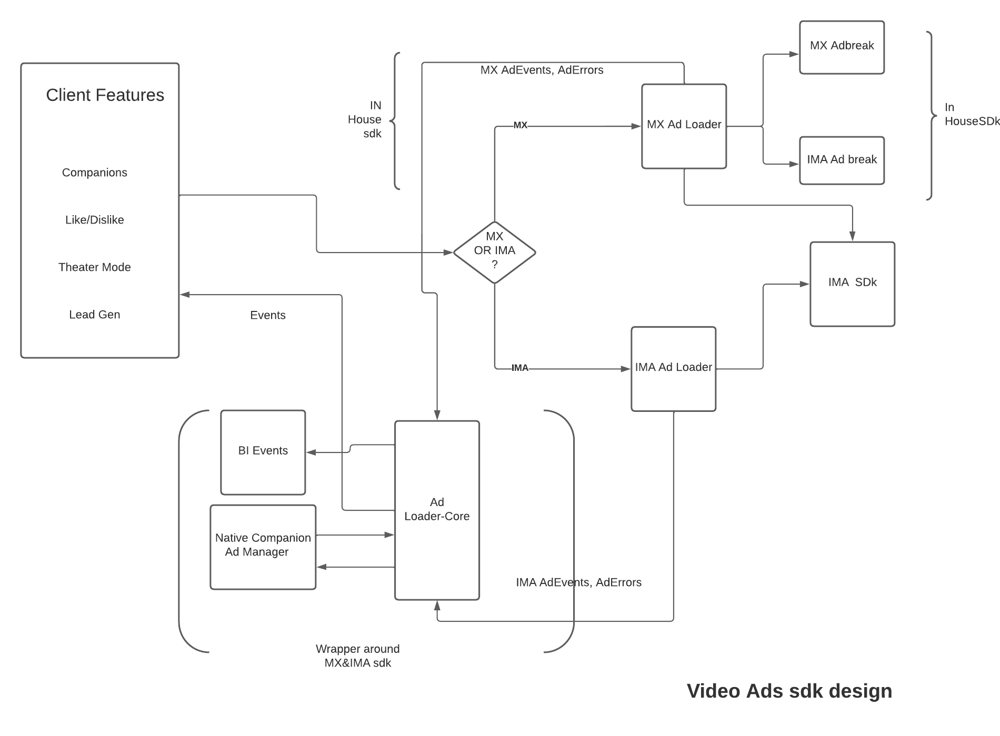

#Ad loader core module 
### Module works with IMA and MX-Video-Ads sdk

- Responsible for showing native companion ads and supports both IMA and MX-Video-Ads sdk
- A delegate for overriding ads behaviour 
- Compose events originated from IMA & MX sdk and expose a common interface to client
- BI events tracking on mx ad server

